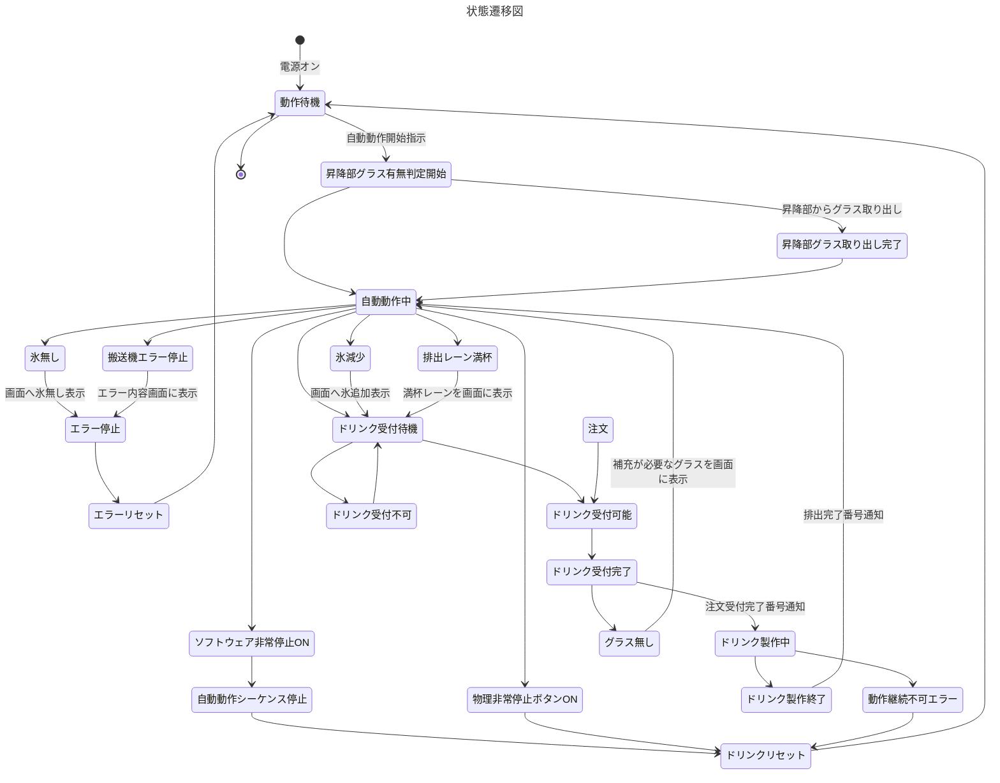

```mermaid
---
title: 状態遷移図
---
stateDiagram-v2

    [*] --> 動作待機:電源オン
    動作待機 --> 昇降部グラス有無判定開始:自動動作開始指示
   
    昇降部グラス有無判定開始 --> 自動動作中
    昇降部グラス有無判定開始 --> 昇降部グラス取り出し完了:昇降部からグラス取り出し
    自動動作中 --> ドリンク受付待機
    昇降部グラス取り出し完了 --> 自動動作中
    自動動作中 --> 氷減少
    氷減少 --> ドリンク受付待機 :画面へ氷追加表示
    自動動作中 --> 氷無し
    氷無し --> エラー停止:画面へ氷無し表示
    自動動作中 --> 排出レーン満杯
    排出レーン満杯 --> ドリンク受付待機:満杯レーンを画面に表示
    自動動作中 --> 搬送機エラー停止
    搬送機エラー停止 --> エラー停止 :エラー内容画面に表示
    エラー停止 --> エラーリセット
    エラーリセット --> 動作待機
    ドリンク受付待機 --> ドリンク受付可能
    自動動作中 --> ソフトウェア非常停止ON
    ソフトウェア非常停止ON --> 自動動作シーケンス停止
    自動動作シーケンス停止 --> ドリンクリセット
    ドリンクリセット --> 動作待機
    自動動作中 --> 物理非常停止ボタンON
    物理非常停止ボタンON --> ドリンクリセット
    注文 --> ドリンク受付可能
    ドリンク受付可能 --> ドリンク受付完了
    ドリンク受付待機 --> ドリンク受付不可
    ドリンク受付不可 --> ドリンク受付待機
    ドリンク受付完了 --> ドリンク製作中:注文受付完了番号通知
    ドリンク製作中 --> ドリンク製作終了
    ドリンク製作終了 --> 自動動作中:排出完了番号通知
    ドリンク製作中 --> 動作継続不可エラー
    動作継続不可エラー --> ドリンクリセット
    ドリンク受付完了 --> グラス無し 
    グラス無し --> 自動動作中:補充が必要なグラスを画面に表示
    
    動作待機 --> [*]

```