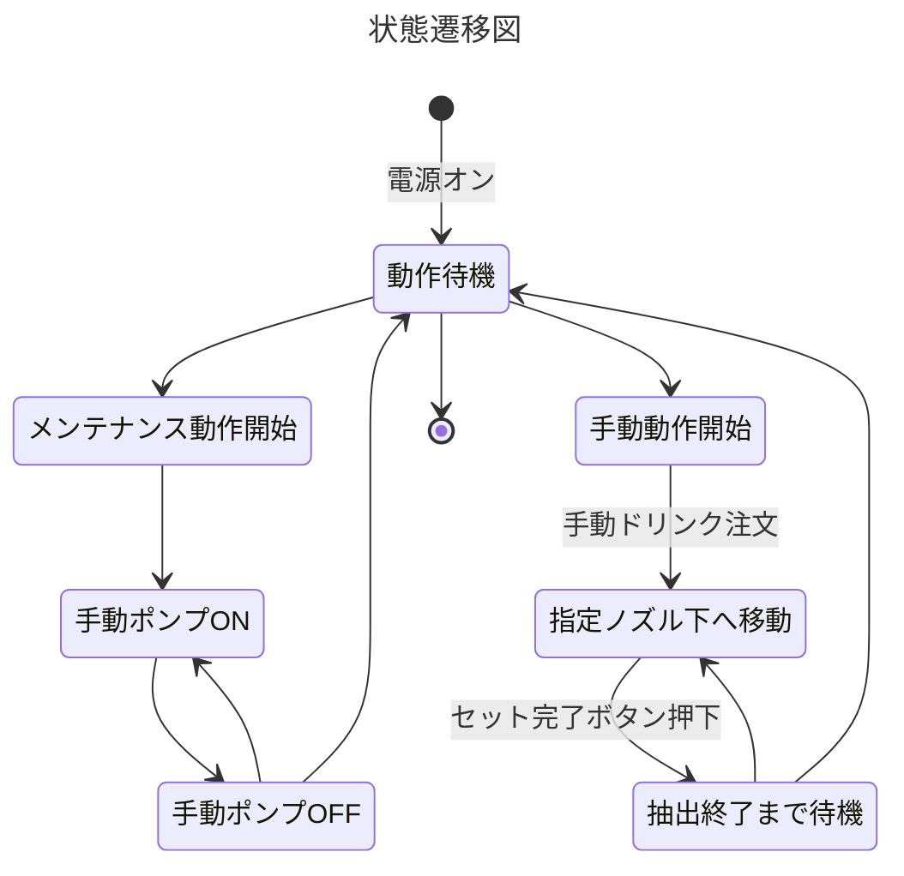

```mermaid
---
title: 状態遷移図
---
stateDiagram-v2

    [*] --> 動作待機:電源オン
    
    
    動作待機 --> メンテナンス動作開始
    動作待機 --> 手動動作開始
    メンテナンス動作開始 --> 手動ポンプON
    手動ポンプON --> 手動ポンプOFF
    手動ポンプOFF --> 手動ポンプON
    手動ポンプOFF --> 動作待機
    手動動作開始 --> 指定ノズル下へ移動:手動ドリンク注文
    指定ノズル下へ移動 --> 抽出終了まで待機:セット完了ボタン押下
    抽出終了まで待機 --> 指定ノズル下へ移動
    抽出終了まで待機 --> 動作待機
    動作待機 --> [*]
    

```