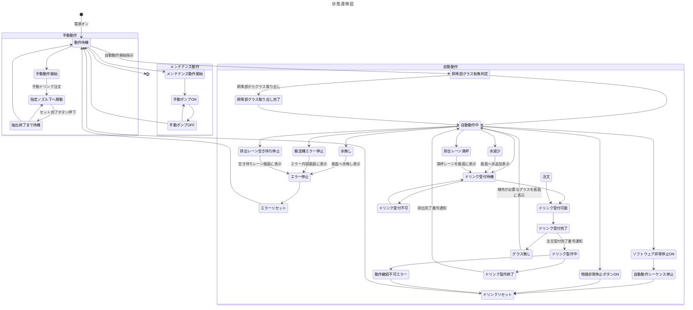

```mermaid
---
title: 状態遷移図
---
stateDiagram-v2

    [*] --> 動作待機:電源オン
    動作待機 --> 昇降部グラス有無判定:自動動作開始指示
    動作待機 --> メンテナンス動作開始
    動作待機 --> 手動動作開始
    state 自動動作 {
        昇降部グラス有無判定 --> 自動動作中
        昇降部グラス有無判定 --> 昇降部グラス取り出し完了:昇降部からグラス取り出し
        自動動作中 --> ドリンク受付待機
        昇降部グラス取り出し完了 --> 自動動作中
        自動動作中 --> 氷減少
        氷減少 --> ドリンク受付待機 :画面へ氷追加表示
        自動動作中 --> 氷無し
        氷無し --> エラー停止:画面へ氷無し表示
        自動動作中 --> 排出レーン満杯
        排出レーン満杯 --> ドリンク受付待機:満杯レーンを画面に表示
        自動動作中 --> 搬送機エラー停止
        搬送機エラー停止 --> エラー停止 :エラー内容画面に表示
        エラー停止 --> エラーリセット
        エラーリセット --> 動作待機
        ドリンク受付待機 --> ドリンク受付可能
        自動動作中 --> 排出レーン空き待ち停止
        排出レーン空き待ち停止 --> エラー停止:空き待ちレーン画面に表示
        自動動作中 --> ソフトウェア非常停止ON
        ソフトウェア非常停止ON --> 自動動作シーケンス停止
        自動動作シーケンス停止 --> ドリンクリセット
        ドリンクリセット --> 動作待機
        自動動作中 --> 物理非常停止ボタンON
        物理非常停止ボタンON --> ドリンクリセット
        注文 --> ドリンク受付可能
        ドリンク受付可能 --> ドリンク受付完了
        ドリンク受付待機 --> ドリンク受付不可
        ドリンク受付不可 --> ドリンク受付待機
        ドリンク受付完了 --> ドリンク製作中:注文受付完了番号通知
        ドリンク製作中 --> ドリンク製作終了
        ドリンク製作終了 --> 自動動作中:排出完了番号通知
        ドリンク製作中 --> 動作継続不可エラー
        動作継続不可エラー --> ドリンクリセット
        ドリンク受付完了 --> グラス無し 
        グラス無し --> 自動動作中:補充が必要なグラスを画面に表示
    }

    state メンテナンス動作 {
        メンテナンス動作開始 --> 手動ポンプON
        手動ポンプON --> 手動ポンプOFF
        手動ポンプOFF --> 手動ポンプON
        手動ポンプOFF --> 動作待機
    }
 
    state 手動動作 { 
        手動動作開始 --> 指定ノズル下へ移動:手動ドリンク注文
        指定ノズル下へ移動 --> 抽出終了まで待機:セット完了ボタン押下
        抽出終了まで待機 --> 指定ノズル下へ移動
        抽出終了まで待機 --> 動作待機
    }
    
    動作待機 --> [*]

```